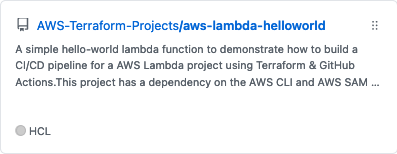
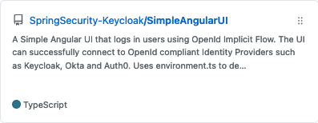
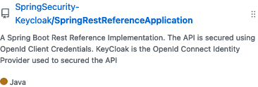
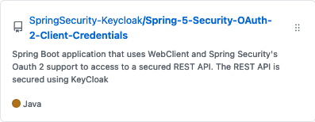

                    

# Featured Articles

  
AWS Lambda CI/CD using GitHub Actions and Terraform

  
  

  
Secure Spring Rest API using OpenId Connect And KeyCloak

  
  

# Featured Projects

  
AWS Lambda CI/CD using GitHub Actions and Terraform

  
  

  
Angular App with Oauth Implicit Grant Flow

  
  
  

  
Spring Boot Rest Application with Oauth Client Credentials Flow

  
   
  

  
Spring Boot WebClient Application with Oauth Client Credentials Flow

  
   
  

<!--
**dvchacko/dvchacko** is a ✨ _special_ ✨ repository because its `README.md` (this file) appears on your GitHub profile.

Here are some ideas to get you started:

- 🔭 I’m currently working on ...
- 🌱 I’m currently learning ...
- 👯 I’m looking to collaborate on ...
- 🤔 I’m looking for help with ...
- 💬 Ask me about ...
- 📫 How to reach me: ...
- 😄 Pronouns: ...
- ⚡ Fun fact: ...
-->
