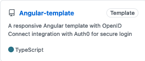

<!-- ⚠️ This README has been generated from the file(s) "blueprint.md" ⚠️-->

  

<h1 align="center">dennis.chacko</h1>

                    

# ➤ Featured Articles

  
A responsive Angular Template with OpenId Connect

  
  

  
AWS Lambda CI/CD using GitHub Actions and Terraform

  
  

  
Secure Spring Rest API using OpenId Connect And KeyCloak

  
  

# ➤ Featured Projects

  
A responsive Angular Template with OpenId Connect

  
  

  
AWS Lambda CI/CD using GitHub Actions and Terraform

  
  

  
Angular App with Oauth Implicit Grant Flow

  
  
  

  
Spring Boot Rest Application with Oauth Client Credentials Flow

  
   
  

  
Spring Boot WebClient Application with Oauth Client Credentials Flow

  
   
  

